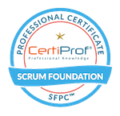

# Sander Grunnekemeijer
### Welkom in mijn TechGrounds repository! &nbsp; 
&nbsp; 
### Over mij: 
Na mijn studie Psychologie in Groningen heb ik enkele jaren in Den Haag gewoond en gewerkt maar  inmiddels ben ik weer woonachtig in Twente, waar ik ook ben opgegroeid. Ik heb een passie voor fotografie, design & usability en wil dit graag meenemen in mijn ontwikkeling tot front-end developer.

In het verleden heb ik mij als autodidacte techneut bezig gehouden met het maken van websites en allerlei computer gerelateerde projecten. Ik wil hier graag meer over leren om vanuit een solide basis een carrière switch te kunnen maken richting front-end development.    

Sinds begin mei 2022 volg ik daarom bij TechGrounds een traineeship om opgeleid te worden tot junior front-end developer. Het traineeship duurt zes maanden en omvat zowel hard- & softskills, die een samenhangend geheel vormen om aansluitend direct als junior developer aan de slag te kunnen. Meer informatie over de TechGrounds traineeships vind je [hier](https://techgrounds.nl).  

In dit repository zijn de door mij gemaakte opgaven en eindopdrachten per behandeld onderwerp te vinden.  
&nbsp;   
### Progress bar: 
  
Bovenstaande progressbar geeft aan hoe ver het traineeship inmiddels gevorderd is en zal regelmatig handmatig door mij worden ge-update   ...tot ik een manier heb gevonden om dit te automatiseren.

 &nbsp; 
### Onderwerpen die tot dusverre in het traineeship aan bod zijn gekomen:  

Softskills:
- Scrum methodiek
- Project management met Jira
- Peer assisted learning

Hardskills:
 - Gebruik van Git / Github
 - HTML Basics
 - CSS Basics
 - Sass CSS preprocessor

 

 &nbsp; 
### Side-projects die ik in de komende maanden wil ondernemen:

- Het maken van mijn eigen portfolio website. 
- Bedrijfswebsite voor een ZZP'er.
- Het automatiseren van de progressbar en verder 'style hacken' van deze README.md. 
&nbsp;   
&nbsp;   

### Recaps:  
###### Na 1 maand:  
##### _"De eerste maand zit er al op, ongelooflijk hoe mijn begrip en skills zijn gegroeid in deze korte tijd. Het is erg interessant, hard werken en soms heb je het gevoel dat dingen nog op z'n plaats moeten vallen. Het peer-assisted leren helpt hierbij: de communicatie binnen de scrum groepjes verloopt steeds beter, als problemen zijn overwonnen vieren we deze kleine stappen richting einddoel. Verder met JavaScript!"_ 

 

